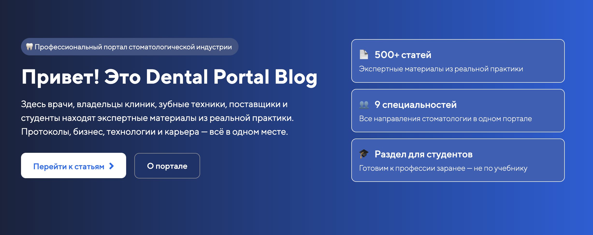

#  🦷 Dental Portal

Разработка блога для стоматологического журнала

---
## Актуальные вопросы

1. Нужно ли учитывать авторство статей или публикация всегда от имени компании (корпоративный блог)?

2. Уточнение по верхнему и нижнему рядам на скриншоте: разные ли это группы категорий?
   ![[categories-dental.png]]

3. Как должен работать поиск по статьям? Если подразумевается автокомплит (варианты появляются, когда пользователь начинает печатать, и обновляются в реальном времени), этот функционал отсутствует в Creatium, потребуется писать отдельное решение.

4. Страница "Студентам" сейчас показывает полный каталог. Это будет статичная страница или на ней будет пул статей для студентов? Это будут отдельные специальные статьи или подборка статей из общего пула статей?
   ![[header-dental.png]]

---
## Предложения по архитектуре

Каталог статей с фильтрами - ок. Рекомендую также добавить:

1. Отдельные страницы категорий без фильтров для формирования смысловых кластеров. Каждый кластер ссылается на похожие по смыслу. Если групп категорий несколько (см п.2 Актуальных вопросов), то отдельный пул страниц под каждую группу категорий.

2. Страницу со всеми категориями, она будет связующим узлом смыслового графа.

## Правки от 13.04.2026

- [x] Поиск по статьям позже
- [x] Скрыть рубрики, где нет статей
- [x] На странице "Для студентов" фильтр по категории "Для студентов"
- [x] Фильтры на страницы категорий